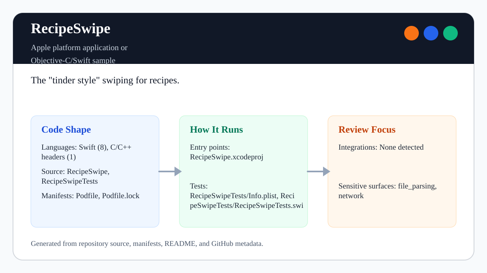
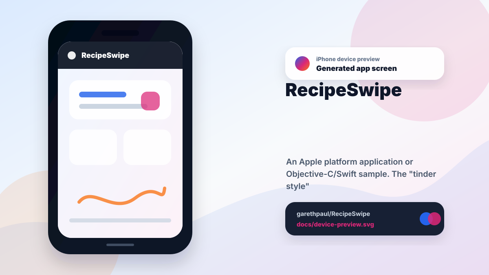

# RecipeSwipe

<!-- README-OVERVIEW-IMAGE -->


## Device Preview

<!-- DEVICE-PREVIEW-IMAGE -->


## Overview

`garethpaul/RecipeSwipe` is an Apple platform application or Objective-C/Swift sample. The "tinder style" swiping for recipes.

This README is based on the checked-in source, manifests, scripts, and repository metadata on the `master` branch. The project language mix found during review was: Swift (8), C/C++ headers (1).

## Repository Contents

- `Podfile` - Apple platform dependency metadata
- `Podfile.lock` - Apple platform dependency metadata
- `RecipeSwipe` - source or example code
- `RecipeSwipe.xcodeproj` - Xcode project file
- `RecipeSwipeTests` - source or example code
- `CHANGES.md` - notable maintenance changes
- `Makefile` - local verification entry points
- `.github/workflows/check.yml` - hosted macOS structural validation
- `docs/plans` - canonical completed maintenance plans
- `plans` - completed maintenance plans
- `scripts` - deterministic static iOS validation checks
- `SECURITY.md` - security reporting and disclosure guidance
- `VISION.md` - project direction and maintenance guardrails

Additional scan context:

- Source directories: RecipeSwipe, RecipeSwipeTests
- Dependency and build manifests: Podfile, Podfile.lock
- Entry points or build surfaces: RecipeSwipe.xcodeproj
- Test-looking files: RecipeSwipeTests/Info.plist, RecipeSwipeTests/RecipeSwipeTests.swift

## Getting Started

### Prerequisites

- Git
- macOS with Xcode for building Apple platform projects
- CocoaPods if dependencies need to be installed

### Setup

```bash
git clone https://github.com/garethpaul/RecipeSwipe.git
cd RecipeSwipe
pod install
```

The setup commands above are derived from repository files. Legacy mobile, Python, or JavaScript samples may require older SDKs or package versions than a modern workstation uses by default.

## Running or Using the Project

- Open `RecipeSwipe.xcworkspace` in Xcode, choose the `RecipeSwipe` scheme, and run it on an iOS 12 or newer simulator/device.

## Testing and Verification

- `make check` is location-independent and runs the complete maintained gate.
- The gate runs 4 pure Swift deck/gesture tests, the native XCTest suite on an
  available iPhone simulator, asset integrity checks, 25 hostile state/workflow
  mutations, and a generic arm64/x86_64 simulator build.
- Simulator discovery and every `xcodebuild` phase run in bounded process groups;
  set `RECIPESWIPE_SIMCTL_TIMEOUT` or `RECIPESWIPE_XCODEBUILD_TIMEOUT` to adjust
  their default 15-second and 600-second limits.
- The swipe controller binds approval and completion to the active card identity,
  uses generation tokens for exactly-once deck consumption, validates finite
  aligned translation/velocity thresholds, and rejects stale pan callbacks.
- Recipe names are control-character sanitized and bounded; card names use
  Dynamic Type, two-line resizing, and explicit VoiceOver action descriptions.
- GitHub Actions runs the same gate on macOS 15 with credential-free checkout,
  read-only permissions, a pinned checkout action, and manual dispatch.

## Configuration and Secrets

- No required secret or credential file was identified in the repository scan. If you add integrations later, keep secrets out of git.

## Security and Privacy Notes

- Review changes touching network requests, sockets, or service endpoints; examples from the scan include RecipeSwipe/Info.plist, RecipeSwipeTests/Info.plist.
- Review changes touching file, media, JSON, XML, CSV, OCR, or data parsing; examples from the scan include RecipeSwipe/API.swift, RecipeSwipe/Info.plist, RecipeSwipe/Recipe.swift, RecipeSwipe/RecipePickerView.swift, and 4 more.

## Maintenance Notes

- Make gates reject caller-controlled root and shell authority, preloaded or
  additional Makefiles, non-executing/error-ignoring Make modes, and unsafe
  shell-sensitive checkout paths before running structural, SwiftPM, XCTest,
  or Xcode validation. Trusted automation must still provide the intended
  Ruby, Swift, and Xcode toolchain on `PATH` and avoid caller-supplied Makefiles.

- This archived sample is maintained as Swift 5 with an iOS 12 deployment target and its vendored CocoaPods dependency.
- See `SECURITY.md` for vulnerability reporting and safe research guidance.
- See `VISION.md` for project direction and contribution guardrails.
- See `docs/plans/2026-06-08-recipeswipe-baseline.md` for the canonical
  static validation and deferred-card-loading baseline.
- See `docs/plans/2026-06-08-empty-card-swipe-guard.md` for the placeholder
  card swipe guard baseline.
- See `docs/plans/2026-06-08-local-recipe-data-guard.md` for the local data
  boundary baseline.
- See `docs/plans/2026-06-09-empty-state-background-sizing.md` for the
  empty-state background sizing guard.
- See `docs/plans/2026-06-09-swipe-delegate-type-guard.md` for the swipe
  delegate type guard.
- See `docs/plans/2026-06-09-recipe-image-fallback.md` for the sample recipe
  image fallback guard.
- See `docs/plans/2026-06-09-recipe-optional-unwrapping.md` for the recipe
  optional unwrapping guard.
- See `docs/plans/2026-06-09-superview-unwrap-guard.md` for the swipe animation
  superview guard.
- See `docs/plans/2026-06-09-swipe-button-layering.md` for the swipe button
  layering guard.
- See `docs/plans/2026-06-09-swipe-button-accessibility-labels.md` for the
  image-only swipe button accessibility label guard.
- See `docs/plans/2026-06-10-xcode-user-state-guard.md` for the tracked Xcode
  user-state file guard.
- See `docs/plans/2026-06-10-empty-state-button-disable.md` for swipe control
  enabled-state synchronization when recipes run out.
- See `docs/plans/2026-06-10-hosted-structural-validation.md` for the pinned
  macOS structural gate and legacy build boundary.
- See `docs/plans/2026-06-12-swipe-pan-state-guard.md` for the nullable pan
  callback guard.
- See `docs/plans/2026-06-13-all-pan-state-guards.md` for repository-wide pan
  callback enforcement and hostile mutation coverage.
- See `docs/plans/2026-06-16-recipe-name-label-autoresizing.md` for the recipe
  name label resizing contract and hostile mutation coverage.

## Contributing

Keep changes small and tied to the project that is already present in this repository. For code changes, document the toolchain used, avoid committing generated dependency directories or local configuration, and update this README when setup or verification steps change.
